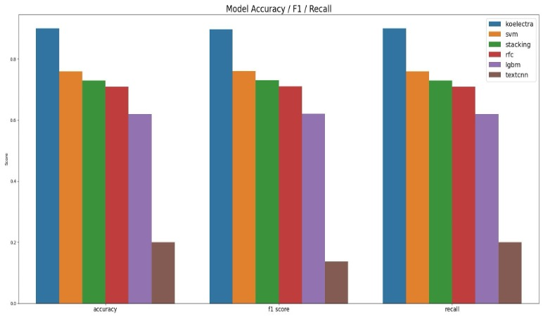

# Real-Time Korean Emotion Classifier 

This project is a real-time Korean emotion classifier that analyzes text input and predicts one of five emotions:  
→ **Anger**, **Sadness**, **Happiness**, **Fear**, **Neutral**. 


It supports multiple model backends including:

- **KoELECTRA** (Transformer-based model from [KoELECTRA](https://github.com/monologg/KoELECTRA))
- **SVM**
- **Stacked Ensemble**  
  (Base: SVM + SGDClassifier + MultinomialNB | Meta: Logistic Regression)

All models are trained on:
- [AI Hub Korean Emotion Datasets](https://aihub.or.kr/aihubdata/data/view.do?dataSetSn=271)
- [AI Hub Dialogue Emotion Dataset](https://www.aihub.or.kr/aihubdata/data/view.do?currMenu=115&topMenu=100&dataSetSn=86)
- Plus custom-augmented corpora

> **Note**: Only trained model files and real-time testing scripts are included.  
> Training scripts and raw datasets are **not** provided.

<p align="center">
  
</p>

---

## Installation

```bash
# Create a new conda environment
conda create -n demo python=3.10
conda activate demo
pip install -r requirements.txt
```

> If Mecab/Konlpy does not work, follow [KoNLPy Guide](https://konlpy.org/ko/v0.4.0/install/) for more instructions. 

### How to run:
- To run all three models
```python
python all_model_test.py
```
- To run a single model:
```python
python single_model_test.py
# You must specify which model you would like to run in the first input 
```

---

## Short Architecture Overview

<p align="center">
  
</p>

This diagram summarizes the inference pipeline of the top-performing models: **KoELECTRA**, **Light ML models**, **Stacked Ensemble**, and **TextCNN (Yoon, 2014)**.  
Each model follows a modular pipeline consisting of:

**Raw Input → Text Cleanup → Tokenization → Vectorization → Inference → Softmax/Argmax → Output**

**Highlights per model:**

- **KoELECTRA** uses pretrained transformers with token ID dictionaries and attention masks.
- **Traditional ML models** (SVM, RFC, LGBM) use MeCab for morphological analysis and TF-IDF vectorization.
- **Stacked Ensemble** combines base model probabilities into a meta-model (logistic regression).
- **TextCNN** uses FastText word vectors and a multi-channel CNN with static/non-static embeddings.

The final output is one of five emotion labels:  
`0: Anger`, `1: Sadness`, `2: Happiness`, `3: Fear`, `4: Neutral`

---

## Results

### Final Testing Performance

In the final testing stage, about **100 custom samples** were evaluated across all models. Below are the performance metrics:

<p align="center">
  
</p>

| Model           | Accuracy | F1 Score | Recall | System CPU Time | User CPU Time | Total Time (s) |
|------------------|----------|----------|--------|------------------|----------------|----------------|
| KoELECTRA        | 0.90     | 0.89702  | 0.90   | 0.01             | 22.02          | 2.20501        |
| SVM              | 0.76     | 0.76086  | 0.76   | 0.00             | 0.02           | 0.02254        |
| Stacked Ensemble | 0.73     | 0.73069  | 0.73   | 0.00             | 0.17           | 0.1702         |

- **KoELECTRA** achieved the best performance across all metrics (Accuracy, F1 Score, Recall).
- **SVM** and **Stacked Ensemble** followed closely behind.
- Other models were trained; however, further training and fine-tuning is needed (**TextCNN** and **Light GBM**)

---

### Runtime Efficiency (CPU & Memory)

Performance monitoring was done over time for the test data set to assess runtime efficiency:

<p align="center">
  
  
</p>

- **CPU Usage**:
  - KoELECTRA showed heavy and spiky CPU consumption, typical of transformer models.
  - SVM and Stacking used minimal CPU, making them suitable for real-time deployment.

- **Memory Usage (RSS)**:
  - KoELECTRA consumed the highest memory (~800MB).
  - SVM and Stacking remained around ~700MB and stable.
---

**Conclusion**:  
KoELECTRA offers the best accuracy, but at higher computational cost. SVM and Stacking provide a good trade-off between performance and efficiency for real-time usage.

---

### License

This repository is intended for **research and internal development use only**.  
Please use it solely for **academic or evaluation purposes**.

---

### Acknowledgements

This project leverages the following resources:

- [AI Hub 감성대화 말뭉치 #1](https://aihub.or.kr/aihubdata/data/view.do?dataSetSn=271)  
- [AI Hub 감성대화 말뭉치 #2](https://www.aihub.or.kr/aihubdata/data/view.do?currMenu=115&topMenu=100&dataSetSn=86)  
- [KoELECTRA by monologg](https://github.com/monologg/KoELECTRA)  
- [FastText + CNN reference: Kim Y. (2014)](https://arxiv.org/pdf/1408.5882)  
- [KoNLPy - Python Korean NLP Toolkit](https://konlpy.org/ko/v0.4.0/install/)

---

## Author

Developed by [@cjmpark](https://github.com/cjmpark) during an internship at **Robocare**, South Korea.

Feel free to fork, star, or open an issue for feedback or collaboration!


------------------

# 실시간 한국어 감정 분류기

이 프로젝트는 실시간으로 한국어 텍스트를 분석하여 다음 5가지 감정 중 하나를 예측하는 감정 분류기입니다:
→ **분노**, **슬픔**, **행복**, **두려움**, **중립**. 


지원하는 모델 백엔드는 다음과 같습니다:

- **KoELECTRA** (Transformer-based model from [KoELECTRA](https://github.com/monologg/KoELECTRA))
- **SVM**
- **Stacked Ensemble**  
  (Base: SVM + SGDClassifier + MultinomialNB | Meta: Logistic Regression)

모든 모델은 다음의 데이터셋으로 학습되었습니다:
- [AI Hub 감성 대화 말뭉치](https://aihub.or.kr/aihubdata/data/view.do?dataSetSn=271)
- [AI Hub 한국어 감정 정보가 포함된 연속적 대화 데이터셋](https://www.aihub.or.kr/aihubdata/data/view.do?currMenu=115&topMenu=100&dataSetSn=86)
- 자체 맞춤형 데이터셋

> **참고**: 본 저장소는 학습된 모델 파일과 실시간 테스트 스크립트만 포함하고 있습니다.
> 학습 스크립트 및 원본 데이터셋은 포함되어 있지 않습니다.

<p align="center">
  
</p>

---

## 설치 방법

```bash
# Create a new conda environment
conda create -n demo python=3.10
conda activate demo
pip install -r requirements.txt
```

> Mecab/Konlpy가 작동하지 않을 경우, [KoNLPy 설치 가이드](https://konlpy.org/ko/v0.4.0/install/)를 참고 하세요. 

### 실행 방법:
- 세 가지 모델을 모두 실행할 경우:
```python
python all_model_test.py
```
- 단일 모델만 실행할 경우:
```python
python single_model_test.py
# 실행 시, 어떤 모델을 사용할지 입력해야 합니다.
```

---

## 모델들 구조 요약

<p align="center">
  
</p>

아래 다이어그램은 성능이 가장 우수했던 KoELECTRA, 전통 ML 모델들, 스태킹 앙상블, TextCNN(Yoon, 2014)의 추론 파이프라인을 요약한 것입니다.
모든 모델은 다음과 같은 공통된 구조를 따릅니다:

**Raw Input → Text Cleanup → Tokenization → Vectorization → Inference → Softmax/Argmax → Output**

**모델별 특징 요약:**

- **KoELECTRA**는 사전 학습된 트랜스포머 기반 모델이며 토큰 ID 사전 및 attention mask 사용
- **전통 ML 모델들** (SVM, RFC, LGBM)은 MeCab 형태소 분석기와 TF-IDF 벡터라이저 사용
- **Stacked Ensemble**은 여러 베이스 모델의 확률 출력을 로지스틱 회귀 기반 메타 모델에 입력
- **TextCNN**은 FastText 임베딩과 멀티채널 CNN 구조 사용

최종 출력 라벨은 다음과 같습니다:
`0: 분노`, `1: 슬픔`, `2: 행복`, `3: 두려움`, `4: 중립`

---

## 결과

### 최종 테스트 성능

총 100개의 커스텀 샘플을 대상으로 최종 테스트를 진행하였으며, 주요 성능 지표는 다음과 같습니다:

<p align="center">
  
</p>

| Model           | Accuracy | F1 Score | Recall | System CPU Time | User CPU Time | Total Time (s) |
|------------------|----------|----------|--------|------------------|----------------|----------------|
| KoELECTRA        | 0.90     | 0.89702  | 0.90   | 0.01             | 22.02          | 2.20501        |
| SVM              | 0.76     | 0.76086  | 0.76   | 0.00             | 0.02           | 0.02254        |
| Stacked Ensemble | 0.73     | 0.73069  | 0.73   | 0.00             | 0.17           | 0.1702         |

- **KoELECTRA**는 정확도, F1, 리콜 모두에서 가장 높은 성능을 보였습니다.
- **SVM**과 **Stacked Ensemble**은 그 뒤를 이었습니다.
- 기타 모델은 성능이 낮았으며, 추가적인 학습 및 튜닝이 필요합니다 (**TextCNN**와 **Light GBM**)

---

### 실행 효율성 (CPU & 메모리 사용량)

모델별 실행 중 CPU 및 메모리 사용량을 모니터링한 결과는 다음과 같습니다:

<p align="center">
  
  
</p>

- **CPU 사용량**:
  - KoELECTRA는 트랜스포머 기반 모델 특성상 높은 CPU 스파이크를 보였습니다.
  - SVM 및 Stacking은 매우 낮은 CPU 사용량을 유지했습니다.

- **메모리 사용량 (RSS)**:
  - KoELECTRA는 약 800MB의 메모리를 소비
  - SVM과 Stacked Ensemble은 약 700MB 수준으로 안정적
---

**결론**:  
KoELECTRA는 최고의 성능을 제공하지만, 상대적으로 높은 연산 자원을 필요로 합니다. SVM과 Stacking은 성능과 실시간 처리 효율성 간의 균형이 우수합니다.

---

### 라이선스

본 저장소는 연구 및 사내 개발 목적으로만 사용 가능합니다.
학술 연구 또는 평가 목적에 한해 활용해 주세요.

---

### 참고 자료

다음의 리소스를 기반으로 구현되었습니다:

- [AI Hub 감성대화 말뭉치 #1](https://aihub.or.kr/aihubdata/data/view.do?dataSetSn=271)  
- [AI Hub 감성대화 말뭉치 #2](https://www.aihub.or.kr/aihubdata/data/view.do?currMenu=115&topMenu=100&dataSetSn=86)  
- [KoELECTRA by monologg](https://github.com/monologg/KoELECTRA)  
- [FastText + CNN reference: Kim Y. (2014)](https://arxiv.org/pdf/1408.5882)  
- [KoNLPy - Python Korean NLP Toolkit](https://konlpy.org/ko/v0.4.0/install/)

---

## 개발자

본 프로젝트는 로보케어 (Robocare) 인턴십 중 [@cjmpark](https://github.com/cjmpark)이 개발했습니다.
문의, 피드백 또는 협업 제안은 Issue 또는 PR로 환영합니다!


